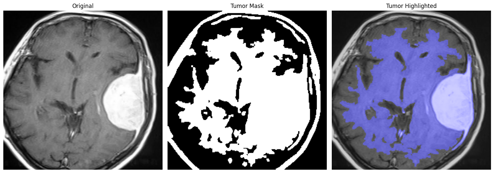

# 🧠 MRI Brain Tumor Segmentation using DSP Techniques

This project demonstrates various **Digital Signal Processing (DSP)** techniques applied to **MRI brain images** for tumor segmentation. Multiple segmentation methods are implemented and compared to analyze their effectiveness on meningioma MRI scans.

---

## 🚀 Features

- **Load and preprocess MRI images** from Google Drive.
- Apply **histogram equalization** for contrast enhancement.
- Implement several segmentation methods:
  - Anisotropic Filtering
  - Otsu Thresholding
  - Adaptive Thresholding
  - K-means Clustering
  - Watershed Segmentation
  - Region Growing
- **Overlay segmentation results** on original images for visualization.
- Compare all methods side by side for analysis.

---

## 🖥️ How to Run

1. **Clone the repository:**
```bash
git clone https://github.com/AwwLivSos/danijal_projects.git
```

2. **Open the notebook in Google Colab.**

3. **Mount Google Drive** (if your datasets are stored there):
```python
from google.colab import drive
drive.mount('/content/drive')
```

4. **Set the path** to your MRI dataset:
```python
import glob
image_paths = glob.glob('/content/drive/MyDrive/DPS MRI slike/meningioma/*.jpg')
```

5. **Run all cells** to reproduce preprocessing, segmentation, and visualization.

---

## 📊 Segmentation Methods

### 1. Anisotropic Filtering
Smooths the image while preserving edges for better tumor extraction.  


### 2. Otsu Thresholding
Automatic global thresholding using histogram analysis.  


### 3. Adaptive Thresholding
Local thresholding that adjusts to regional variations.  


### 4. K-means Clustering
Unsupervised clustering of pixel intensities for segmentation.  


### 5. Watershed Segmentation
Uses distance transform and markers to segment tumor regions.  


### 6. Region Growing
Segments the tumor starting from a seed point based on intensity similarity.  


---

## 📈 Comparison

All methods can be **compared side by side** using the `compare_all()` function, which visualizes the original image, preprocessed image, and segmented results from all methods.  
  

---

## 🔧 Dependencies

- Python 3.x
- OpenCV (`cv2`)
- NumPy
- Matplotlib
- scikit-image
- scikit-learn
- PIL

Install missing packages via pip:
```bash
pip install opencv-python numpy matplotlib scikit-image scikit-learn pillow
```

---

## ✨ Author

**Danijal Alibegović**  
Email: your.email@example.com  
Portfolio: [Your Portfolio Link](https://yourportfolio.com)

---

## 📌 Notes

- Dataset folder path must be updated according to your Google Drive structure.
- All segmentation masks are overlaid in red for easier visualization.
- Histogram equalization is applied to enhance contrast before segmentation.

